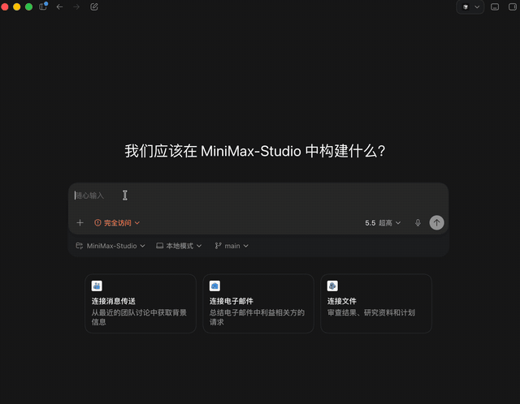

# Worktrunk Workflows

一个用于 [Worktrunk](https://worktrunk.dev)（`wt`）的 Agent Skill，帮助 AI 编程助手设计、配置、操作和排障 Git worktree 工作流。

[English](README.md)

## 这是什么

Worktrunk 本身已经把几个关键动作做好了：创建 worktree、切换进去、运行 hooks、合并回来、最后清理掉。真正麻烦的是，AI Agent 面对一个真实仓库时，得判断这些动作应该怎么组合。

hook 应该写进项目的 `.config/wt.toml`，还是写进个人的 `~/.config/worktrunk/config.toml`？依赖安装应该阻塞 `wt switch`，还是放到后台跑？什么时候可以清理 worktree？LLM commit 命令能不能放到项目配置里？怎么让 Claude、Codex 或其他 Agent 在不同 checkout 里并行做事，而不是把改动搅在一起？

这个 skill 解决的就是这些判断题。它不是 Worktrunk 的二次封装，也不提供新的命令行工具。它是一组给 Agent 看的操作知识：入口文件、按主题拆开的参考文档，以及一个零依赖仓库探测脚本。目标很简单：让 Agent 把 Worktrunk 当成一套生命周期系统来用，而不是临时拼几条命令。

## 它能帮 Agent 做什么

- 动手改配置前，先探测仓库结构和可用工具。
- 判断团队配置、个人配置、临时覆盖分别应该放在哪里。
- 为创建、切换、提交、合并、删除这些阶段设计 hooks。
- 给每个 worktree 启一个稳定端口的 dev server。
- 在有价值的时候复制 ignored cache，避免盲目复制整个目录。
- 在隔离分支里并行启动多个 AI Agent。
- 配置 LLM 自动生成提交信息，但不把个人命令写进项目配置。
- 清理 worktree 前先展示列表、dry-run 和风险。
- 排查 shell 集成、hook 失败、`wt list` 变慢、Agent 插件等问题。

## 为什么这件事容易做错

Git worktree 的概念不复杂。麻烦通常出现在边角：目录怎么命名，依赖要不要重新装，后台服务谁来停，缓存能不能复用，分支是否已经合并，哪个 worktree 可以删。

Worktrunk 把这些生命周期动作收拢到 `wt switch`、`wt merge`、`wt remove`、hooks 和配置里。但 Agent 仍然需要判断力。一个不好的回答，可能会把个人 LLM 命令写进共享配置，把很慢的安装放进阻塞 hook，留下后台进程，或者在没展示预览前就建议删分支。

这个 skill 把这些判断显式写出来：先探测，再选参考文档，再设计工作流；涉及风险的地方先预览；改完后用 Worktrunk 自己的命令验证。

## 实际演示

一段演示就够了：用户只描述目标，Agent 在底层处理 Worktrunk 的整套流程。



## Demo 提示词

安装 skill 后，可以直接把下面这些提示词发给 AI 编程助手。这里故意写短一点，方便录演示时观众一眼看懂。

### 配置 Worktrunk

```text
为这个仓库配置 Worktrunk，并创建保守的 .config/wt.toml。
把依赖安装、快速检查、合并前验证放到合适的生命周期阶段。
改文件前先说明方案。
```

### 并行启动多个 AI Agent

```text
启动两个隔离分支：

- feature-code-review：让 Claude 做 Code Review
- feature-docs：让 OpenCode 改进文档

直接启动这些 Agent，并告诉我每个分支在哪里运行。
```

### 每个 worktree 一个 dev server

```text
为每个 worktree 添加独立 dev server。
端口不要冲突，删除分支工作区时服务也要自动停止。
```

### 安全清理

```text
检查哪些工作区可以清理。
有未提交改动或状态不明确的内容不要删除。
```

## 安装

把仓库克隆到你的 Agent skills 目录。

```bash
git clone https://github.com/Sylearn/wtflow.git ~/.claude/skills/worktrunk-workflows
```

如果使用 Cursor、Codex、OpenCode 或其他 Agent，把这个目录放到对应的 skill 加载位置，然后引用 `worktrunk-workflows`。

## 仓库结构

```text
SKILL.md                           # skill 入口和操作规则
references/                        # 按主题拆开的 Worktrunk 参考文档
scripts/probe_worktrunk_project.py # 零依赖仓库探测脚本
agents/openai.yaml                 # OpenAI/Codex 风格清单
LICENSE                            # MIT 许可证
```

## 本地验证

```bash
python3 -m py_compile scripts/probe_worktrunk_project.py
python3 scripts/probe_worktrunk_project.py
uvx ruff check scripts/
```

## 许可证

MIT © 2026 Sylearn